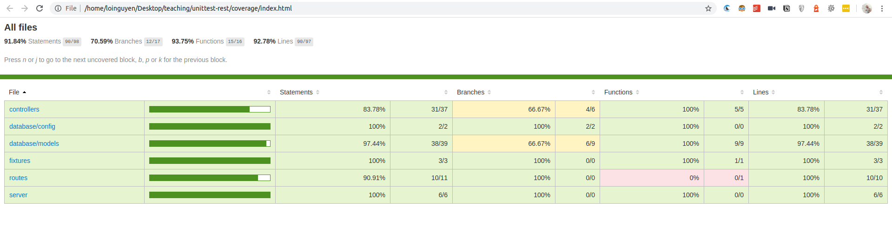

# Sequelize, PostgreSQL, Node.js UnitTest Rest Workshop

## Presentation slide: https://bit.ly/2VxmkoJ
## Testing framework: [Jest](https://jestjs.io/)
## Fixture creation: [faker](https://www.npmjs.com/package/faker)
## Prerequisite
* [Js Clean Code](https://github.com/ryanmcdermott/clean-code-javascript)
* Docker
* Docker Compose
* Nodejs 10

## Usage

- `cp .env.example .env`
- `docker-compose up -d` Note that test_db is created at after this command,  init script is `./init.sql`
- `npm install`

- Run sample sum.js `NODE_ENV=test jest controllers/sum.test.js`
- Run all tests: `NODE_ENV=test npm test`

## Homework

* Required: Open `controllers/index.test.js` then write all test case in TODO comment
* Optional: Write unit test for 1 class/commponent in your currernt working project at VXR, for example: write unit test for fare config at `vapi`

## Evaluation:

Test Coverage > 90%

## Demo:

